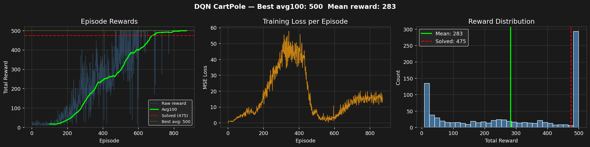

# Reinforcement Learning — Learning Journey & Implementations

> A structured, from-scratch learning project covering core RL theory,
> deep learning foundations, and applied Deep Q-Learning.
> Built as part of a self-directed RL curriculum.

[](https://www.python.org/)
[](https://pytorch.org/)
[](https://gymnasium.farama.org/)
[](LICENSE)

---

## Project Structure

```
RL-Basics/
│
├── data/                              # Downloaded datasets
│   └── MNIST/raw/                     # MNIST handwritten digits (70,000 images)
│
├── deep_learning_for_RL_basics/       # DL foundations before Deep RL
│   ├── basic_nn_using_only_numpy.py   # XOR neural network — pure NumPy, manual backprop
│   ├── basic_nn_using_torch.py        # XOR neural network — rebuilt in PyTorch
│   └── sine_analysis_using_nn.py      # Sine wave regression — continuous output, tanh
│
├── dqn_basics/                        # Deep Q-Learning implementation
│   ├── dqn_CartPole.py                # Main DQN/DDQN — argument-switchable
│   ├── dqn_implementation_without_args.py  # Earlier vanilla DQN iteration
│   └── DQN_TUNING_LOG.md             # 18-run hyperparameter study
│
├── gym_env/                           # Custom Gymnasium environments
│   ├── envs/
│   │   └── grid_world.py              # Custom GridWorld environment
│   └── wrappers/
│       ├── clip_reward.py
│       ├── discrete_actions.py
│       ├── reacher_weighted_reward.py
│       └── relative_position.py
│
├── practice_tuts_rl/                  # First steps in RL
│   ├── init_check.py                  # Environment setup verification
│   └── setting_up_env.py             # Blackjack Q-learning agent
│
├── Karapathy_intro_to_nn.ipynb        # Karpathy micrograd walkthrough (Week 10)
├── dqn_training.png                   # Final DQN training result plot
├── main.py                            # Project entry point
├── pyproject.toml                     # Project config (uv)
└── uv.lock                            # Locked dependencies
```

---

## Learning Progression

### Stage 1 — First Steps in RL (`practice_tuts_rl/`)

The starting point. Built hands-on intuition for the RL loop before any deep learning.

**`init_check.py`**
Environment setup verification — confirmed Gymnasium installation, CUDA availability,
and basic env interaction (reset, step, render).

**`setting_up_env.py`**
First real RL implementation — a Q-learning agent for Blackjack following
Sutton & Barto Chapter 5. Built from scratch using a `defaultdict` Q-table,
ε-greedy policy, and temporal difference updates.

```python
# Core Q-learning update:
future_q      = (not terminated) * np.max(self.q_values[next_obs])
temporal_diff = reward + γ * future_q - Q(s, a)
Q(s, a)      += lr * temporal_diff
```

Key concepts learned: MDP loop, Q-values, ε-greedy exploration,
TD updates, episode termination handling.

---

### Stage 2 — Deep Learning Foundations (`deep_learning_for_RL_basics/`)

Built the neural network knowledge needed for Deep RL — from scratch,
understanding every equation before letting PyTorch automate it.

**`basic_nn_using_only_numpy.py`**
XOR neural network in pure NumPy — no frameworks. Every operation written by hand:

- Forward pass: `Z1 = X @ W1 + b1`, `A1 = sigmoid(Z1)`
- Loss: `MSE = (1/m) · Σ(A2 - y)²`
- Backpropagation: full chain rule derivation for all 4 weight matrices
- Weight update: `W -= lr * dW`

Result: 4/4 XOR predictions correct (0.0019, 0.9983, 0.9981, 0.0016).

**`basic_nn_using_torch.py`**
Exact same XOR network rebuilt in PyTorch — side-by-side comparison:

```
NumPy manual              →   PyTorch equivalent
──────────────────────────────────────────────────
W1 = np.randn(2,4)        →   nn.Linear(2, 4)
Z1 = X @ W1 + b1          →   self.layer1(x)
manual backward_prop()    →   loss.backward()
W -= lr * dW              →   optimizer.step()
```

**`sine_analysis_using_nn.py`**
Sine wave regression — fitting `y = sin(x) + noise` with a 3-layer network.
Tanh activations chosen because sin(x) range is -1 to +1.
Diagnosed and fixed overfitting using Dropout(p=0.2).

**`Karapathy_intro_to_nn.ipynb`**
Walkthrough of Andrej Karpathy's micrograd — building autograd from scratch.
Covers how `loss.backward()` works internally: the computation graph,
chain rule through arbitrary operations, and backprop without any framework.

---

### Stage 3 — Custom Environments (`gym_env/`)

Custom Gymnasium-compatible environments — essential preparation for
autonomous parking work.

**`envs/grid_world.py`**
Full Gymnasium API implementation: `reset()`, `step()`, `render()`,
`observation_space`, `action_space`.

**`wrappers/`** — Five environment wrappers:

| Wrapper | Purpose |
|---|---|
| `clip_reward.py` | Clamp rewards to [-1, +1] |
| `discrete_actions.py` | Convert continuous → discrete action space |
| `reacher_weighted_reward.py` | Custom reward shaping for reacher task |
| `relative_position.py` | Transform observations to relative coordinates |

---

### Stage 4 — Deep Q-Learning (`dqn_basics/`)

Main implementation — DQN built component by component, then systematically
tuned across 18 runs to fully understand its behaviour and failure modes.

---

## DQN Implementation — `dqn_CartPole.py`

### Architecture

```
Input (4)  →  Linear(4→64)  →  ReLU  →  Linear(64→64)  →  ReLU  →  Linear(64→2)

4 inputs:   [cart_position, cart_velocity, pole_angle, angular_velocity]
2 outputs:  [Q_value_left, Q_value_right]
Parameters: 4,610 total
```

### Components

| Component | Class | Description |
|---|---|---|
| 1 | `QNetwork` | Fully connected net, state → Q-values |
| 2 | `ReplayBuffer` | `deque(50000)`, random sampling breaks correlation |
| 3 | `DQNAgent` | Two networks + ε-greedy + learn() with DDQN flag |
| 4 | `train_dqn()` | Episode loop with early stopping at avg100 ≥ 475 |
| 5 | `plot_training()` | 3-panel dashboard: rewards, loss, distribution |

### Vanilla DQN vs Double DQN

```python
# Vanilla DQN — same network selects AND evaluates (overestimation bias)
next_q     = self.target_network(next_states)
max_next_q = next_q.max(dim=1)[0]

# Double DQN — Q-net selects action, target evaluates it (bias eliminated)
next_actions = self.q_net(next_states).argmax(dim=1)
max_next_q   = self.target_network(next_states)\
               .gather(1, next_actions.unsqueeze(1)).squeeze(1)
```

Switch between them at runtime — no code changes needed:

```bash
# Vanilla DQN (default)
python dqn_basics/dqn_CartPole.py

# Double DQN
python dqn_basics/dqn_CartPole.py --algo ddqn

# Double DQN, custom episodes, with render
python dqn_basics/dqn_CartPole.py --algo ddqn --episodes 1000 --render
```

---

## Final Results

Both Vanilla DQN and Double DQN solved CartPole-v1 (`avg100 = 500`).



| Algorithm   | avg100 | Mean reward | Episodes to solve |
|-------------|--------|-------------|-------------------|
| Double DQN  | 500    | 302         | ~850              |
| Vanilla DQN | 500    | 283         | ~875              |

**Key finding from 18 runs:**
`lr=0.0001` was the root cause of all previous failures.
Runs 1–16 used `lr ≥ 0.0005` and never solved CartPole.
Both algorithms solved with `lr=0.0001`.

```
Solved config:
  lr            = 0.0001   ← the critical insight
  epsilon_min   = 0.05
  epsilon_decay = 0.997
  target_update = 75 steps
  buffer        = 50,000
  batch_size    = 64
  loss          = MSELoss
```

---

## Hyperparameter Tuning Study

Full 18-run systematic study with per-run observations, failure analysis,
and corrected conclusions:

📄 **[dqn_basics/DQN_TUNING_LOG.md](dqn_basics/DQN_TUNING_LOG.md)**

Quick reference:

| Parameter     | Best value | Key insight |
|---------------|-----------|-------------|
| Learning rate | **0.0001** | Root cause of all instability at higher values |
| Epsilon min   | 0.05      | Eliminates catastrophic collapses |
| Epsilon decay | 0.997     | Slower = more buffer diversity |
| Target update | 75 steps  | Balance between stability and speed |
| Buffer size   | 50,000    | Marginal improvement over 10k |
| Batch size    | 64        | Better than 128 for this scale |
| Normalisation | OFF       | CartPole state already well-scaled |
| Grad clipping | None      | Unnecessary at lr=0.0001 |

---

## Environment Setup

```bash
# Clone
git clone https://github.com/Devam-032/RL-Basics.git
cd RL-Basics

# Create environment with uv
uv venv venv --python 3.10
venv\Scripts\activate          # Windows
source venv/bin/activate       # Linux/Mac

# Install dependencies
pip install torch torchvision --index-url https://download.pytorch.org/whl/cu126    #Check CUDA version properly before installing
uv pip install gymnasium matplotlib numpy

# Verify GPU
python -c "import torch; print(torch.cuda.is_available())"
```

**Requirements:** Python 3.10 · PyTorch 2.x · Gymnasium 0.29+ · NumPy · Matplotlib

---

## Tech Stack

| Tool | Version | Usage |
|------|---------|-------|
| Python | 3.10 | Core language |
| PyTorch | 2.12.0+cu126 | Neural networks, autograd |
| Gymnasium | 0.29+ | RL environments |
| NumPy | 2.x | Array operations, manual backprop |
| Matplotlib | 3.x | Training visualisation |
| uv | latest | Fast Python package management |

---

## What's Next

```
✓ Phase 1 — Math & intuition foundations
✓ Phase 2 — Core RL (MC, TD, Q-tables, Blackjack)
✓ Phase 3 — Neural network intuition (XOR, PyTorch, micrograd)
✓ Phase 4 — Deep Learning (sine regression, MNIST classifier)
→ Phase 5 — Deep RL
    ✓ DQN / Double DQN on CartPole
    → REINFORCE (Policy Gradients)
    → PPO on LunarLander
  Phase 6 — Applied RL (custom AV parking env, capstone)
```

---

*Built from scratch — no pre-built RL libraries used for core implementations.*
*Every algorithm implemented by hand before using abstractions.*